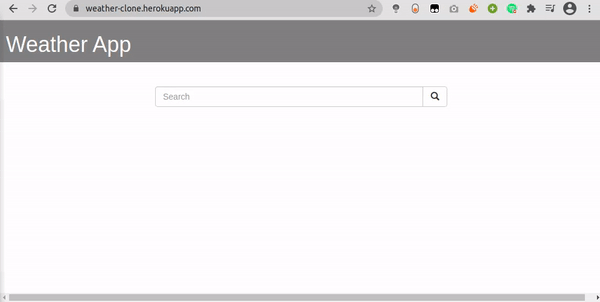

# Weather App

Weather application built using Django Framework and OWM api

[](https://weather-clone.herokuapp.com/)

## Key Features
- `OWM API is used to fetch wetaher details`
- `The pages are dynamically loaded`
- `Simple UI`


<div align="center"></div>


## Installation

Use the package manager [pip3](https://pip.pypa.io/en/stable/) to install the dependancies.

```python
pip3 install requirements.txt
```

## Usage
To start the application on local machine, clone the repo and type this command in the terminal.

```python
python3 manage.py runserver
```

## Contributing
Pull requests are welcome. For major changes, please open an issue first to discuss what you would like to change.

Make sure to fork the repo, before going for a pull request.


### Show some :heart: and :star: the repo to support the project

### Star the Repo in case you liked it :)

### © [kehsihba19](https://bit.ly/kehsihba19)
